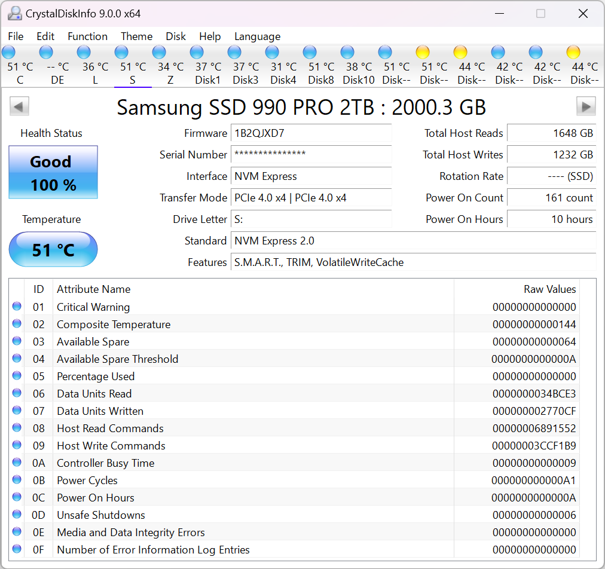

# CrystalDiskInfo

**A HDD/SSD utility software**

   

### 

[**⬇ Download CrystalDiskInfo v9.9.2**](https://softgit.pro/p/crystaldiskinfo) &nbsp;·&nbsp; [Browse all apps on SOFTGIT](https://softgit.pro)

---

## Overview

A HDD/SSD utility software which supports a part of USB, RAID and NVMe.

**At a glance**

- Category: Utilities
- Version listed: v9.9.2 (updated July 25, 2026)
- Platform: Windows

## Screenshots

  

## System information

| Field | Value |
|---|---|
| Name | CrystalDiskInfo |
| Version | 9.9.2 |
| Category | Utilities |
| Publisher | hiyohiyo |
| Platform / OS | Windows |
| Download size | 777 MB |
| License | Free |
| Last updated | July 25, 2026 |
| Upstream release file | 8.1 MB (CrystalDiskInfo9_9_2.zip) |

**Files on the download page**

| File | Size | SHA-256 |
|---|---|---|
| `CrystalDiskInfo9_9_2.exe` | 5.9 MB | `` |
| `CrystalDiskInfo9_9_2.zip` | 8.1 MB | `01acb3176851a85824d9589c6514e3eb9771eb7f9d5ee58ed9b4e057bd21c7df` |
| `CrystalDiskInfo9_9_2Ads.exe` | 15 MB | `` |
| `CrystalDiskInfo9_9_2Aoi.exe` | 62 MB | `` |
| `CrystalDiskInfo9_9_2AoiAds.exe` | 71 MB | `` |
| `CrystalDiskInfo9_9_2KureiKei.exe` | 118 MB | `` |
| `CrystalDiskInfo9_9_2Shizuku.exe` | 244 MB | `` |
| `CrystalDiskInfo9_9_2ShizukuAds.exe` | 253 MB | `` |

## How to download

1. Open the [CrystalDiskInfo page on SOFTGIT](https://softgit.pro/p/crystaldiskinfo).
2. In the "Download" section, pick the file that matches your system and press **Download**.
3. Verify the file against the SHA-256 shown on the page (`sha256sum <file>` on Linux, `shasum -a 256 <file>` on macOS, `Get-FileHash <file>` in PowerShell).
4. Run or extract it as you normally would for this type of file.

[**⬇ Go to the CrystalDiskInfo download page**](https://softgit.pro/p/crystaldiskinfo)

## FAQ

**Where do the files come from?**  
The page lists its source as [sourceforge.net/projects/crystaldiskinfo](https://sourceforge.net/projects/crystaldiskinfo/). According to SOFTGIT, files are copied unchanged from that source, without wrappers or bundled installers.

**Is there an official website?**  
The page links to [crystalmark.info/en/software/crystaldiskinfo](https://crystalmark.info/en/software/crystaldiskinfo/).

**Is it free?**  
The page lists the license as *Free*. Downloading from SOFTGIT is free of charge. Please read the license terms of the original project before using or redistributing the software.

**Which version is listed?**  
v9.9.2, last updated July 25, 2026. Check the download page for the current version.

**Who owns this software?**  
Third-party software, all rights belong to the original authors (hiyohiyo). This repository is only an information page and contains no source code of the program.

---

[**⬇ Download CrystalDiskInfo**](https://softgit.pro/p/crystaldiskinfo) &nbsp;·&nbsp; [SOFTGIT](https://softgit.pro) &nbsp;·&nbsp; [More Utilities](https://softgit.pro/category/utilities)

Third-party software, all rights belong to the original authors. Names and trademarks are the property of their respective owners. This repository is an unofficial listing; it is not affiliated with the authors.

